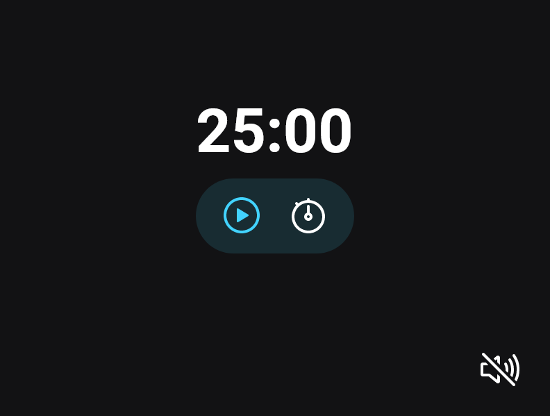

<h1 align="center">Focus Timer</h1>

  <a href="#-tecnologias">Tecnologias</a>&nbsp;&nbsp;&nbsp;|&nbsp;&nbsp;&nbsp;
  <a href="#-projeto">Projeto</a>&nbsp;&nbsp;&nbsp;|&nbsp;&nbsp;&nbsp;
  <a href="#-layout">Layout</a>

 

  

## 🚀 Tecnologias

Esse projeto foi desenvolvido com as seguintes tecnologias:

- HTML e CSS
- Javascript
- Git e Github

## 💻 Projeto

Este projeto foi desenvolvido em aula do Stage 05: Avançando com JavaScript, do curso Explorer da Rocketseat. Este projeto é um contador de tempo, que simula a técnica Pomodoro. Nele, o usuário insere um tempo desejado, e após o tempo determinado o usuário é notificado através de um alerta de som.

Este projeto aplica diversos conhecimentos de JavaScript, como:

- import/export (ES6 Modules)
- Design Pattern: Factory
- manipulação de DOM
- Injeção de dependências
- Event Listeners
- métodos: setTimeout() e clearTimeout(), padStart(), padEnd()
- Construtor: Audio()

Além de diversos conhecimentos de HTML e CSS.

### Features deste projeto:

- Usuário pode definir o tempo desejado
- Controles: play, pause, stop
- Som ambiente (toggle on/off)
- Versão mobile e desktop

Você pode visualizar o projeto através [DESSE LINK](https://viviansanchez.github.io/rocketseat-explorer-stage05-projeto03/)!

## 🔖 Layout

Você pode visualizar o layout do projeto através [DESSE LINK](https://www.figma.com/file/jrp8xKSeooL8uwmXPUPrBI/Explorer-Stage-05-Projeto-01/duplicate). É necessário ter conta no [Figma](https://figma.com) para acessá-lo.
